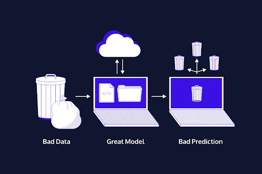

# 1. Introduction to Data

NOTE: You might see LaTex notation. That's because this content was originally spread throughout a number of Jupyter notebooks (which supports LaTeX)

## Data Gaps

**Garbage In, Garbage Out** 
    
Our data-driven conclusions are only as strong, robust and well-supported as the data behind them. 

Understanding and communicating data means asking the **right** questions so that we end up with useful relevant data. 

- Do we have sufficient data to answer the question at hand? 
- Can the data I have at present answer my exact question? 

---

## Address Bias

Sound science means examining bias and controlling variables wherever possible

Bias-Focused Questions
- Who participated in the data? 
- Who was left out? 
- Who made the data? 

---
## What are statistics? 

Statistics help us test the likelihood of an event happening by random chance versus systematically. 

**statistics**: science that is concerned with methods for collecting, analyzing and interpreting data. 

**data**: Any collection of facts, such as numbers, words, measurements or descriptive details. 

**data + statistics**: data can be used to *make correlations, make predictions* and *draw conclusions* about a population based on a sample. 

**visualizations**: charts and/or graphs that make data easier to analyze and understand. 

### Case Study in Visualization: Challenger Shuttle. 

Evidence of the O-ring failure at lower temperature launches existed long before the Challenger shuttle tragedy. However, it hadn't been presented in a way that the visualization was clear to the decision makers. 

The visualization of rocket launches was organized by data which made it difficult to see the pattern of launch failures at lower temperatures. 

**Data literacy** helps make informed decisions by ensuring that a visualization properly reflects the problems or questions being posed. 

---
## Numeracy

Humans are good at perceiving or visualizing numbers we can count or numbers we can use in context. A common example is *percent change*. 

Numbers without day-to-day context are more difficult to understand. (i.e. the GDP of a country). A common example is *percent change*! We understand the concept of a change in percent, and we can visualize it in small localized contexts, but we struggle to relate to the **significance** or impact of percent change that relate to numbers without that day-to-day context. 

We understand the **calculation**, but not the impact. 

One of the principle goals of **data literacy** is to provide content and clarifications to ensure that audiences aren't only reading the correct numbers but understanding what they mean. 

## Example: Orders of Magnitude and the Context of Time in Numeracy

As you go through this quick thought experiment, read each line and really try to picture the event. Try to wrap your head around the time it takes. Then try to compare the context of the event before it. How different or similar is it? 

1. Clap your hands. That is about 1 second.
2. Take a sip of water. That's about 10 seconds. 
3. Reheat dinner in the microwave. That's usually about 100 seconds. (1:40)
4. Take a coffee break. That's usually about 1000 seconds (16:40)
5. Watch a very long movie. That's about 10,000 seconds (2:46:40)
6. A day. That's a a few hours shy of 100,000 seconds (1d 3:46:40)

The next order of magnitude is 1 million seconds, which is roughly 11 days or about a week and a half. 

1 billion seconds? That's 32 years. 

### 1 billion hand claps all at once.

The loudness of 1 billion hand claps all at once is not simply additive in a linear fashion due to the logarithmic nature of the decibel (dB) scale used to measure sound intensity.

Here's a rough estimation process:
- Each clap is about 70 dB.
- Decibels are logarithmic, meaning every 10 dB increase represents a tenfold increase in sound intensity.

To calculate the combined loudness:
- Doubling the sound sources (claps) increases the sound level by about 3 dB.
- For 1 billion (10^9) claps, we calculate the number of doublings: \( \log_2(10^9) \approx 30 \).

Therefore, starting from 70 dB for a single clap:
- \( 70 \text{ dB} + (3 \text{ dB} \times 30) = 70 \text{ dB} + 90 \text{ dB} = 160 \text{ dB} \).

So, 1 billion hand claps at once would theoretically produce a sound level of around 160 dB. This level is extremely loud, equivalent to the noise near a rocket engine at launch, and would be harmful to human hearing.

### 100 million sips of water

To calculate the volume of 100 million sips of water, we need to determine the average volume of a single sip. Let's use an average sip size of 50 milliliters (ml), which is a reasonable estimate.

1. Calculate the volume of one sip:
    - 1 sip = 50 ml

2. Calculate the volume of 100 million sips:
    - 100,000,000 sips × 50 ml/sip = 5,000,000,000 ml

3. Convert milliliters to liters (since 1 liter = 1,000 ml):
    - 5,000,000,000 ml ÷ 1,000 = 5,000,000 liters

So, 100 million sips of water would be approximately 5,000,000 liters

To visualize how large 5 million liters is, let's convert it into more relatable units and comparisons.

1. **Cubic Meters:**
    - 1,000 liters = 1 cubic meter
    - 5,000,000 liters = 5,000 cubic meters

2. **Swimming Pools:**
    - An average Olympic-sized swimming pool holds about 2,500 cubic meters of water.
    - 5,000 cubic meters = 2 Olympic-sized swimming pools.

3. **Standard Bathtubs:**
    - A standard bathtub holds approximately 150 liters of water.
    - 5,000,000 liters ÷ 150 liters/bathtub ≈ 33,333 bathtubs.

Therefore, 5 million liters is equivalent to 5,000 cubic meters, which can fill about 2 Olympic-sized swimming pools or approximately 33,333 standard bathtubs.

### 10 million times the power of a microwave

The power of a typical microwave oven is around 1,000 watts (1 kW). To find out the combined power of 10 million microwaves, you can multiply this power by 10 million:

\[ 1,000 \text{ watts} \times 10,000,000 = 10,000,000,000 \text{ watts} \]

10 billion watts can be expressed in gigawatts (GW):

\[ 10,000,000,000 \text{ watts} = 10 \text{ gigawatts} \]

So, 10 million times the power of a microwave is 10 gigawatts.

For comparison, 10 gigawatts is a substantial amount of power, equivalent to the output of approximately 10 large nuclear reactors or a significant portion of a large power plant's capacity.

... You get the idea. 