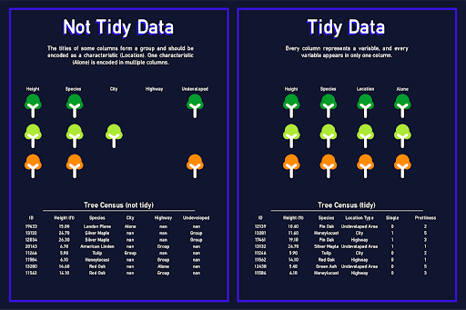

# 2. Data Collection

## Data Ethics and Privacy

**PII (Personally Identifiable Information)**
- address, email, phone number, SSN, credit card numbers, medical records, etc. 


There are 4 primary categories of Ethics in data. 

1. **Consent**: Individuals mus tbe informed and give their consent for information to be collected.
2. **Ownership**: Anyone collecting data must be aware that individuals have ownership over their information. 
3. **Intention**: Individuals must be informed about

   - What information is to be taken
   - How that information will be stored
   - How that information will be used
4. **Privacy**: Information about individuals must be kept secure. **This is especially important for any and all PII.**


----
## Collecting Data

The first step in most data-related work is to collect the data. 

### Ways of Collecting Data

1. **Static Data**

   - Information that is collected and then never changes. 
   - This can be the generation of new data that is measured directly such as
     - surveys
     - observational studies
     - experimental results
2. **Live, Continuous, ever-changing up-to-date information**:

   - clickstreams from websites/apps
   - IoT sensors, trackers (i.e. weather data)
   - Time Series data
   - Stock tickers
3. **pre-existing data**

   - data freely available for public use. 
   - data collected by others for different purposes that may be useful to you


### Data Sources

#### Examples of free data

- [WHO: Global Health Obvervatory](https://www.who.int/data/gho/)
- [WHO: Mental Health](https://www.who.int/health-topics/mental-health#tab=tab_1)
- [WHO: Road Traffic Mortality](https://www.who.int/data/gho/data/themes/topics/topic-details/GHO/road-traffic-mortality)
- [Data: FiveThirtyEight](https://data.fivethirtyeight.com/)
- [data.gov](https://www.data.gov/)
- [UNICEF Data](https://data.unicef.org/)
- [Google's Dataset Search](https://datasetsearch.research.google.com/)


---
## Data Types and Quality

**data** (Didn't we define this already??)... data in *data science* means a **collection of organized observations**.

### Types of Organization

**Methodology**: *how* the data was collected.

**Shape**: Spreadsheets/tabular format is the most common. 

- **variables**: (i.e. columns) represent *what we measure*
- **observations**: (i.e. rows) are individual instances of each variable. 

```
NOTE: A circular definition of the two that provides a good indication of the
complex relationship of data is: 

  A row represents multiple variables per observation. 
  
  A column represents multiple obvervations per variable. 
```

### The Shape of Data


- **variables** are represented in the diagram by the "measurables" 
  - height, species, city, highway,e tc. 

- **observations** are represented by each instance or entity of a "tree"


 
We can see that well-organized datasets have **good variables**. 

So what's a **good** variable? 
- They should measure only **one/single/uno** characteristic. 
- They shouldn't be a characteristic themsevles
  - e.g. "location" > "highway"


### Variable Types

This is a key concept. Internalize this. It is an important means of differentiating between "measuring" and "categorizing".

#### Numerical Variables

There are two important components to a numerical variable:
1. the numeric representation
2. the unit that gives the representation a meaning or significance. 

There are also 2 types of numerical variables
1. **discrete** variables, or *things that we count".
   - no. of kids in your family
   - no. of dents the kids put in your car. 
   - leaves on a tree
   - no. of beds or baths

2. **continuous** variables, or _things that we measure._
   - time
   - temperature
   - weight
   - height

One of the most challenging aspects of differentiating between the
two is the "type" versus "the data that was captured". Continuous
variables are often truncated during the data collection process
for a number of reasons (and not all of them are good ones!)

#### Categorical Variables

These are variables that represent characteristics described by words or relative values. 

There are three different types of categorical variables: 
1. **nominal** variables are named values. 
   - I think of these as labels. They are descriptive and provide as much as possible about the 
2. **dichotomous** variables are binary values. 
   - These are classic boolean variables. on/off, yes/no, black/white, true, false, Red Sox/Yankees
3. **ordinal** variables are ordered or ranked values. 
   - These are variables that provide a subjective measurement. They are commonly used in surveys (e.g. NPS scores, Likert scale)

Ordinal variables are often misunderstood, because they can be represented by numerical symbols. An example is rating pain on a scale from 1 to 10. Our ability to categorize pain is non-linear, and subjective, such that the distance between each number is based on perception rather than a quantified value. It's a ranked, qualitative difference. Another (better) example is the MPAA rating categories for movies, or the pole position in F1 racing. 

---
## Data Problems

### Messy Data Problems

- **Typographical Errors/Data Entry Errors**
  - this leads to incorrect categorization, misinterpretation from the onset of analysis. 
- **Missing Data**
  - Examples are no value, NaN, Null, etc. 
  - This can lead to failed computations, incorrect summarization
  - while many libraries have the ability to ignore some of these values it is very important to re-inspect data w/o NaNs. Removing observations or variables that have a signficiant amount of missing data may impact your analysis or render it useless. 
  - We're going to go into missing data in a bit more detail in just a bit. 
- **inconsistent coding**
  - this is an example of using mixed case for ENUM entries (i.e. MALE, male) or using "no", 0, and FALSE for the same variable. 
  - This can lead to failed computations, incorrect assumptions. 
  

### Missing Data

#### Missing Completely at Random

- There isn't any deeper meaning to this missing data. It's just not there. 
- Usually, this data was omitted accidentally or because it wasn't available. 
- It's extremely rare that we'll actually **know** that the reason that this data was missing, so it requires detective work. 

```Look for patterns```


#### Missing at Random

- ```I hate this term```
- This type of 'missing data' means that we can _predict if one value is missing based on the value in another variable_
- ```LOOK FOR PATTERNS!!!!```

EXAMPLES
- Race times for heat 7 out of 8 heats were missing milliseconds because a different stopwatch was used. 
- There's a stereotype that you never ask a woman her weight or age, so in some health studies you might find that men have weight and age explicitly measured, whereas they may be absent or estimated for women. (This is less common these days)

A More Famous Example: 

- [Excerpt from How not to be wrong: Jordan Ellenberg](https://medium.com/@penguinpress/an-excerpt-from-how-not-to-be-wrong-by-jordan-ellenberg-664e708cfc3d)
- [Same Story: Different Source](https://www.historyofdatascience.com/abraham-wald-a-statistical-hero/#:~:text=While%20many%20reasoned%20that%20the,t%20hitting%2C%20notably%20the%20engine.)

TL;DR...

During WW II, Abraham Wald helped the Allies protect planes from German artillery. 

One major tradeoff in military aerodynamics is between durability and maneuverability/speed. The fastest planes that can maneuver with the greatest agility are the lightest planes. However, they are also the least durable. To protect the pilots and aircraft, we have to place armor on the plane.

This was mostly specific to bombers, which tend to have straight flight paths. British sorties were struggling to reach bombing targets due to significant damage, or didn't have enough planes reaching their targets. 

Researchers were analyzing the planes returning from combat, trying to determine where to add armor. They postulated that the locations on the planes that had the most bullet holes should have added armor. This was largely on the fuselage and wings of the aircraft.

After several iterations, results weren't improving. Wald (a mathematician) was brought in and identified that the missing data was predictable due to a type of bias known as survivorship bias. 

The military had only been analyzing the planes that made it back. The missing data (or bullet holes in this case) were that planes with enormous amounts of bullets hitting the engine were falling out of the sky before they could return. 

(Ironically, Wald died in a plane crash in 1950.)

#### Structurally Missing

- This is the case where we wouldn't expect a value to begin with. (i.e. no value is normal)
- However, although expecting no value might be normal we must still consider **standardization** of missing-ness. 
  - How do we handle null values? 
  - How do we calculate or summarize numeric variables where a lack of data is acceptable? 


#### Considerations about missing data and a final note...

- What is missing? 
- What can you do about it? 
- ```LOOK.FOR.PATTERNS!```

A final note on missing data... 

Just because there is a hole in a donut, doesn't mean you can't sell it. 

Captain Hanson Gregory of Rockport, Maine supposedly invented the donut hole (and the modern donut) by cutting a hole in donuts to ensure that they baked evenly. The first commercial products appeared over 100 years later in 1973 (Dunkin' Donuts 'Munchkins') and 1976 (Tim Hortons 'Timbits').

This creates two wonderful anecdotes to remind us that sometimes the most powerful data at our disposal is what isn't in front of us: 
- Abraham Wald
- Donut Holes

---

### Accuracy

Accuracy is extremely important. Some would argue it's everything. For the most part this is true. 

When dealing with continuous variables, accuracy becomes constrained by the needed fidelity of the measurement. 

When dealing with text-based variables, accuracy can be perceived, despite different representations. M, Male, male, man, masculine might all perceived as equivalent responses for a value to the human eye, but to machines, these are 5 **different** representations. 

Common issues with accuracy are 
- poor, inconsistent measurement
- lack of necessary fidelity
- mistakes! typos! 
- duplicated observations


#### Techniques for evaluating accuracy

- Compare observed results with expectations and common sense
  - evaluate outliers to the distributions
  - look for clusters of improbable or erroneous data (i.e. a systematic flow or error with the data rather than just one-off errors or edge cases)

- Think critically about how errors can occur? 
  - audit the data collection process. Where can errors and flaws sneak into the process? 
  - What gaps are sensible to resolve or constrain? (and how?)
  - Look for manual processes, or workarounds that circumvent constraints or sanitization

- Look for duplicates
  - Identify areas where data can be duplicated. 
  - You can't always prevent this, and sometimes it is even desirable in different data architectures. 
  - It is more critical to know where data can be duplicated than to prevent it. 


These are often some of the hardest challenges data professionals face. It is difficult to validate the accuracy of data that represents observations that we're trying to understand. 

#### Mechanisms for managing accuracy

1. Data Dictionaries
   - Defining your variables with clear expectations about value ranges and what is being measured or observed is critical for others working with the data, especially those who are unlikely to have been present when the data was collected or observed.


2. Segmentation
   - segmenting data during data collection based on how it was collected or generated (i.e. manually vs. programmatically) can help provide insight into the potential for data errors or accuracy issues. 


3. Standardization (units and measurement collection methods)
   - How do we know that the information representing multiple instances of a variable are measured or collected in the same manner?
     - were patients in a clinical study weighed in full clothes or a johnny? 
     - what time of day? 
     - was height measured in shoes or barefoot? 
     - were 40 yard dash times on grass or the track? outdoor or indoor? 


Without standard units and measures, as well as standardizations in the way that the data is represented and encoded, the resultant data may be unreliable. These are issues that become invisible to data engineers and data scientists during analysis, but may have a significant impact on the resulting information and insights. 

---

### Validity

**Does the data actually measure what we think it measures?**

This topic is about the evaluation of the relationship between a dataset and its purpose. Data can be valid in one case, but invalid in another. 

A common example of this is using "width" as a proxy for measuring "age" in a tree. Another example is the use of Olympic times or World Cup performances as measurements of yearly statistics. (The Olympics and World Cup don't occur yearly)

### Samples

Obtaining data for an entire population can be difficult in many real world scenarios. Sports statistics for professionals is simple, because the information for every player in a league is available. In pharmaceuticals, or life sciences, this is less the case. As of this writing, obtaining health and vital signs for ~10 billion people is not practical

As a result, we have to borrow from the science of experimentation, which includes cutting out a subset of the entire population. 

A sample is a subset of a population, limited by one or more constraints to make studying that population more practical (or even possible at all.)

There are two primary types of sampling. 

1. Convenience Samples
2. Representative Samples

#### Convenience Samples

We refer to these as "convenience samples", because they are convenient. These are "quick and dirty." It's very fast. 

These are very flawed, but they aren't without their benefits. A convenience sample's primary benefit is speed. The data is quickly available which is useful for a basic, preliminary understanding of the dataset. 

**Examples:**
- comparing MLB catchers to represent batting statistics for all major league players.
- using NY state census response to reflect the entire United States. 

The disadvantages are numerous. These types of samples aren't good for representing the broader population because they are unlikely to be sufficiently randomized, nor have a balanced representation of the features (variables) within the dataset.


One of the most important dimensions of the sample we have to consider is it's size. The sample size must be large enough to provide enough diversity to accurately represent the shape and variance characteristics of the overall population.

The consequences of convenience are various categories of **bias**. **Bias** is the arch-enemy of good data. It can result in incorrect, inaccurate and invalid information which generates insights that lead us astray. 

Samples of a population that aren't a sufficient representation of that data often risk becoming anecdotes rather than becoming targeted insights that drive intelligence. 


#### Representative Samples

We refer to these as a "representative sample', because (if it isn't obvious) the sample represents the greater population.

The goal of a representative sample is represent that population as accurately as possible. In terms of data science, this means _finding a mix of observations that contain all of the features in the larger population._

This is hard, and it involves techniques to randomize and minimize bias. Explaining this in detail would make this document a lot longer than it already is, so I'd prefer to hand wave over it right now. (Happy to supplement in later iterations upon request. My Venmo account is...).


