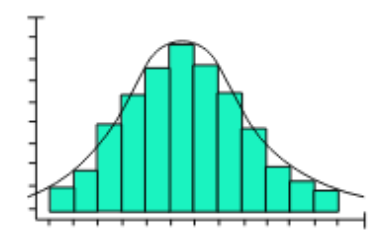
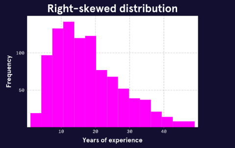
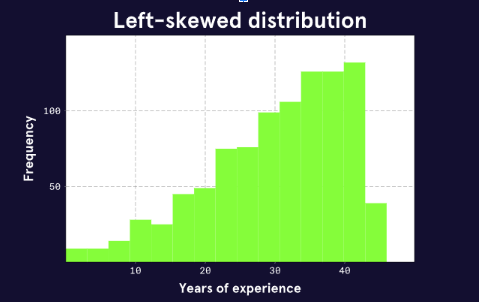
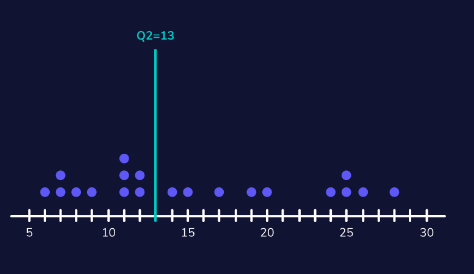
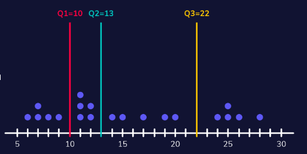
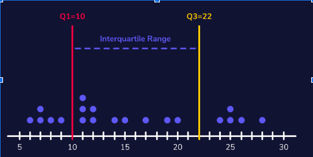

# 3. Statistical Thinking

Statistical thinking focuses on the concept of **summarization** or **summary statistics** that help measure or describe the variables in a data set. 

## Describing Categorical data

Categorical information is mostly qualitative. 

Summarizing qualitative information is usually done through some of the following methods: 

- **frequency**: the count or occurrence of a variable. Examples might be number of violinists in a string session, tires on a car, etc. 

- **proportion or partition** is the frequency divided by the total sample size (or population if you were lucky enough to obtain it). 

- **percentage** is a proportion converted to a numeric percentage (because it's easier for us to reason than fractions.)

---

## Describing Numerical data

Numerical data is summarized in a much more mathematical manner than qualitative information, because the values are calculable. 

### Distribution

Distribution is a function that shows all possible values of a variable and how frequently each value occurs. 

#### Normal Distribution

A normal distribution appears hill or bell-shaped. This is extremely common, because it represents the increase and decrease of frequency surrounded around a common center. This pattern represents datasets and shapes that are typically predictable and simple to calculate

#### Skewed Distributions. 

A skewed distribution is asymmetrical, with a steep change in frequency and a flatter, "trailing" change in frequency on the other. 

Right-skewed distributions are also known as positively-skewed or increasing skew. Note how the tail is on the right. 

Left skewed distributions are also referred to as negatively-skewed or decreasing skew. Note how the tail is on the left. 

The reason for the nomenclature has to do with the concept of measures of spread. As mentioned before we measure in terms of central tendency. Therefore the notion of a positive skew suggests that the tail is perceived as a trailing outliers that are pulling volatile measures of central tendency away from the center of a comparable normal distribution. Likewise, a negative skew is pulling towards the "left" (towards decreasing values).

The impact of skew is that it can lead to incorrect assumptions when only provided with the **mean** or **standard deviations**. Since averages are based on values, there is an innate assumption of symmetry or equal distribution above and below. Standard deviations only consider the span of values, not their frequency. Without considering the frequency of the calculated values, we can't provide a mathematical facsimile that represents the shape of the data. 

### Measures of Central Tendency

These are measurements or calculations that are used to find the "energy" or "heat" of a data set. 

**Mean** (a.k.a. average) is probably the most well known measure of central tendency. This is calculated by dividing the sum of all values in a sample/population by the total number of values in that population. 

For perfectly normal distributions, the mean can be very accurate. However, in skewed distributions, outliers can "pull" the mean away from true "central tendency" because the mean is influenced by the specific values within the distribution. 

The **median**, is a positional measure of central tendency which is simply the "middle value" of the distribution. (This is also known as the 50th percentile or the second quantile). If there are 21 values sorted from smallest to largest, then the median is whatever value occurs at position "11". (For even numbered distributions there are various methods for calculating the median, most often by finding the midpoint between the two adjacent values)

Given the positional nature of the median, it is more resilient to outliers. 

### Measures of Spread. 

**Spread** (Sometimes referred to as range) is a category of measurement that determines the breadth of the dataset. It has some value on its own, but it is often measured as a reference to central tendency. This helps us understand how broad or narrow the values are stretched around the "tentpole". Breadth is often synonymous with stability. A narrow/tall distribution is considered stable due to it being arranged closely around the center, and a broad/wide distribution is considered unstable or dynamic due to values extending relatively far from the center. 

**Range** is the simplest form of spread, which measures the difference between the minimum and maximum values of a distribution. As with the **mean**, because it is based on the values in the distribution, it can be distorted by outliers and anomalous data. 

**Standard deviation** is a calculation that finds the average squared distance from each data point to the mean and takes the square root of the result. Performing calculations against averages in normal distributions often result in cancelling out all values. One approach to preventing this is to square these values. Unfortunately, squaring numbers makes them less relevant to the values in the dataset. This makes them difficult to rationalize. The mathematical solution is to take the square root. (This is a common mathematical approach, there are others, and you'll get to meet them later!). 

The breadth or width of standard deviation is representative of the variety in values within the distribution. This is a better representation than range, but it still suffers from outlier distortion.

You might recall that I referred to the **median** as the 50th percentile or second quartile. In the graphic below, you'll note that there are 21 values. You can probably guess from the way that they are arranged that the data is right skewed. 

Another common, outlier-resilient, manner for measuring spread is called **the inter-quartile range (IQR)**. The **IQR** measures the difference between the first and third quartile. (Q1 and Q3, or the 25th and 75th percentile). 

This graphic represents the position of the quartiles mentioned above.

This graphic represents the IQR itself, which is the spread of values between Q3 and Q1. 

Another way of defining the IQR is that it represents the "middle 50%" of the data. Similar to the median, the IQR is resilient to outliers, by trimming those values based on position. Since the IQR is based on position, the same number of values to either side of the IQR are removed, which means that skewed sets might remain skewed. 

### Outliers and Robust Measurements