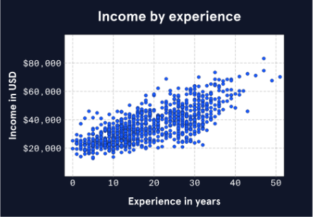

# 3. Statistical Thinking

Statistical thinking focuses on the concept of **summarization** or **summary statistics** that help measure or describe the variables in a data set. 

## Describing Categorical data

Categorical information is mostly qualitative. 

Summarizing qualitative information is usually done through some of the following methods: 

- **frequency**: the count or occurrence of a variable. Examples might be number of violinists in a string session, tires on a car, etc. 

- **proportion or partition** is the frequency divided by the total sample size (or population if you were lucky enough to obtain it). 

- **percentage** is a proportion converted to a numeric percentage (because it's easier for us to reason than fractions.)

---

## Describing Numerical data

Numerical data is summarized in a much more mathematical manner than qualitative information, because the values are calculable. 

### Distribution

Distribution is a function that shows all possible values of a variable and how frequently each value occurs. 

#### Normal Distribution

A normal distribution appears hill or bell-shaped. This is extremely common, because it represents the increase and decrease of frequency surrounded around a common center. This pattern represents datasets and shapes that are typically predictable and simple to calculate

#### Skewed Distributions. 

A skewed distribution is asymmetrical, with a steep change in frequency and a flatter, "trailing" change in frequency on the other. 

Right-skewed distributions are also known as positively-skewed or increasing skew. Note how the tail is on the right. 

Left skewed distributions are also referred to as negatively-skewed or decreasing skew. Note how the tail is on the left. 

The reason for the nomenclature has to do with the concept of measures of spread. As mentioned before we measure in terms of central tendency. Therefore the notion of a positive skew suggests that the tail is perceived as a trailing outliers that are pulling volatile measures of central tendency away from the center of a comparable normal distribution. Likewise, a negative skew is pulling towards the "left" (towards decreasing values).

The impact of skew is that it can lead to incorrect assumptions when only provided with the **mean** or **standard deviations**. Since averages are based on values, there is an innate assumption of symmetry or equal distribution above and below. Standard deviations only consider the span of values, not their frequency. Without considering the frequency of the calculated values, we can't provide a mathematical facsimile that represents the shape of the data. 

### Measures of Central Tendency

These are measurements or calculations that are used to find the "energy" or "heat" of a data set. 

**Mean** (a.k.a. average) is probably the most well known measure of central tendency. This is calculated by dividing the sum of all values in a sample/population by the total number of values in that population. 

For perfectly normal distributions, the mean can be very accurate. However, in skewed distributions, outliers can "pull" the mean away from true "central tendency" because the mean is influenced by the specific values within the distribution. 

The **median**, is a positional measure of central tendency which is simply the "middle value" of the distribution. (This is also known as the 50th percentile or the second quantile). If there are 21 values sorted from smallest to largest, then the median is whatever value occurs at position "11". (For even numbered distributions there are various methods for calculating the median, most often by finding the midpoint between the two adjacent values)

Given the positional nature of the median, it is more resilient to outliers. 

### Measures of Spread. 

**Spread** (Sometimes referred to as range) is a category of measurement that determines the breadth of the dataset. It has some value on its own, but it is often measured as a reference to central tendency. This helps us understand how broad or narrow the values are stretched around the "tentpole". Breadth is often synonymous with stability. A narrow/tall distribution is considered stable due to it being arranged closely around the center, and a broad/wide distribution is considered unstable or dynamic due to values extending relatively far from the center. 

**Range** is the simplest form of spread, which measures the difference between the minimum and maximum values of a distribution. As with the **mean**, because it is based on the values in the distribution, it can be distorted by outliers and anomalous data. 

**Standard deviation** is a calculation that finds the average squared distance from each data point to the mean and takes the square root of the result. Performing calculations against averages in normal distributions often result in cancelling out all values. One approach to preventing this is to square these values. Unfortunately, squaring numbers makes them less relevant to the values in the dataset. This makes them difficult to rationalize. The mathematical solution is to take the square root. (This is a common mathematical approach, there are others, and you'll get to meet them later!). 

The breadth or width of standard deviation is representative of the variety in values within the distribution. This is a better representation than range, but it still suffers from outlier distortion.

You might recall that I referred to the **median** as the 50th percentile or second quartile. In the graphic below, you'll note that there are 21 values. You can probably guess from the way that they are arranged that the data is right skewed. 

Another common, outlier-resilient, manner for measuring spread is called **the inter-quartile range (IQR)**. The **IQR** measures the difference between the first and third quartile. (Q1 and Q3, or the 25th and 75th percentile). 

This graphic represents the position of the quartiles mentioned above.

This graphic represents the IQR itself, which is the spread of values between Q3 and Q1. 

Another way of defining the IQR is that it represents the "middle 50%" of the data. Similar to the median, the IQR is resilient to outliers, by trimming those values based on position. Since the IQR is based on position, the same number of values to either side of the IQR are removed, which means that skewed sets might remain skewed. 

### Outliers and Robust Measurements

**Outliers** are extreme values "distant" from the rest of the distribution. There are various mathematical definitions or rules for determining what it means to be "distant". I'm not aware of an official standard, however a commonly used rule is the **1.5 x IQR rule**, which categorizes data points that are 1.5 * IQR above the third quartile or below the first quartile as outliers. 

Outliers are like individually skewed values. As discussed above, outliers have greater impact on value-based measure.
This means that outliers have greater impact on mean than median as a measure of central tendency and a creater impact on standard deviation than IQR as a measure of spread. 

Robustness or outlier-resilience is a concept of selecting certain statistical methods because of their ability to avoid influence from extreme values. Using robust approaches are often the appropriate choices for measuring central tendency and spread of distributions in the presence of outliers or skew. That said, these aren't silver bullets. As you will see in the future lessons, a systematic view of variables, their summaries and the approaches used for those summaries provides the dimensionality of understanding we seek to analyze our data. 

### Aggregation

Aggregation is the "roll-up" or combination of multiple variables, summarized by another variable. (For instance frequency)

A distribution plot separates groups into visual features on a graph we refer to as modes. (Usually viewed across a categorical variable). Once separated, the data is summarized by a numerical variable. 

The **mode** is the value with the highest frequency. It is the "peak" of the distribution. While it's often uninteresting for computational purposes, it helps us visually identify interesting features in a variable. 

All examples you've seen thus far have been a unimodal distribution. This means there is only a single peak. A classic normal distribution is a perfect example of a unimodal distribution. 

A distribution can have more than one mode. The chart below is an example of a **bimodal distribution**. (bimodal means two!)

This can occur when there are differences or variations across categories of another variable. 

The distribution above reflects a frequency chart of musicians based on their musical experience in years. 

There is a mode at ~15 years and another at roughly ~30 years.

The distribution is influenced by a third, dichotomous variable, which determines membership in a band. The mean of musicians in a band was 14.4 years, and the mean of musicians not in a band was 26.2 years. There is a correlation to the modes in the diagram demonstrating a potential relationship between the groups identified by the dichotomous variable.

---

### Variable Relationships

As we saw in the previous section, the use of **aggregation** is an excellent means of exploring variable relationships. 

This concept will be explored in greater detail later. However, when comparing variables it's important to consider the type of variables, based on the limitations of summarization afforded to the qualities of those types. 

A variable analysis based on a relationship to itself is univariate analysis. This is "loosely" considered a relationship. 

When we think of relationships, we are usually thinking of bivariate or multivariate analysis. 

Bivariate analysis provides three categories of analysis. 

1. Comparison of numerical variables
2. Comparison of categorical variables
3. Mixed Mode analysis (numerical vs. categorical)

For this introductory segment, I'm going to focus on the comparison of numerical variables, because it is one of the easiest to visualize. 

Scatter plots are a popular means of plotting numerical variables on a Cartesian plane. In this case experience (in years) is reflected on the x-axis, and income (in USD) is reflected on the y-axis. 

The characteristics of the plot show an amorphous blob of dots that generally move from the lower left to the upper right. 

It isn't a perfect line, but we can describe some of the relationships in a linear fashion. 
- low level experience appears to be mostly associated with lower levels of income. 
- higher levels of experience appear to be mostly associated with higher level of income. 

Based on the features of the plot, we can begin to make inferences about the data: 
- income appears to mostly increase with experience level
- there is variation. (i.e. it's not a flat line)

#### Correlation Coefficients

Our eyes are very powerful tools of analysis, but unfortunately, they still can't beat Texas Instruments or a CPU for basic computation. 

Our eyes are good at qualifying or even estimating the quantification of relationships, but to be certain, we need to create mathematical quantities that can be compared, especially given the dynamic nature of plots like the scatter plot. No two plots are the same, so we need to find a way to compare relationships effectively. 

 A correlation coefficient is a numeric measurement of a **linear** correlation, which represents a statistical (or mathematical) relationship between two variables. 

It is a standardized measure (or **Beta coefficient**) that falls between +/- 1 to avoid skewed distribution when variables are measured in different units or at different scales. This measure also allows us to compare the strength of relationships between completely different plots and sets of variables. 

Directionality of coefficients is similar to basic linear analysis. **Positive coefficients** move in the same direction, meaning that higher values of one variable are associated with higher values in another variable. This notion of increasing values in both variables is considered "proporitional". **Negative coefficients** move in opposite directions, such that higher values in one variable are associated with lower values in another variable. This notion of a decreasing in one variable corresponding to the increase in another is referred to as "inverse proportional"

Directionality is important, however it is not the determining factor for a relationship. The strength or magnitude of a relationship is measured by its proximity to 1. A correlation coefficient 1 is absolutely related, while a coefficient of 0 is completely unrelated. 

