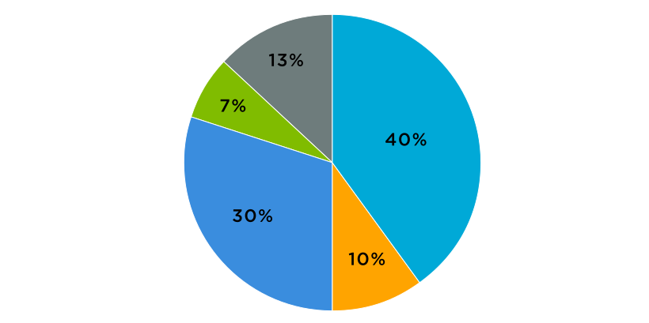

# 4. Visualization

## Visualization Basics 

As you discovered towards the end of [Statistical Thinking](3-statistical-thinking.md), data visualization is about communication. Data relationships are translated to a **visual representation.** This visual representation is how we perceive and rationalize the mathematical relationships that exist between data points. 

1. Visualization accomplishes a goal
   - Exploration of existing data to uncover new insights and learning
   - strengthen arguments and key concepts with visual aid
   - share a data-driven idea

    
2. (Chart/Graph) design decisions can help or hinder how effectively visualizations communicate the features of the data.
   - chart type
   - color
   - labeling / annotation
   - context

```text
Tricks for remembering X/Y in a Cartesian plane. 

    X-axis looks like a person doing jumping jacks on the ground 
    (i.e. a horizontal plane) 
    
    Y-axis... if you cut it in half, the top of a "Y" is a V for "vertical"
```
### Data Types / Charts

This section is intended to just be a "taste" to charts and visualization. 
There are dozens of chart types and styles. [Matplotlib Charts](https://matplotlib.org/stable/gallery/index) and [Seaborn Charts](https://seaborn.pydata.org/examples/index.html) provide a good amount of examples. 

More than one possible chart can be used to describe a dataset, however different types of charts emphasize different questions, arguments or relationships between variables. 

Below is a quick table for some common/basic problem-to-chart relationships, followed by an example of each. 

| Problem | Chart Type |
| --- | --- | 
| Changes over time | Line / Bar Charts | 
| Part-whole relationships / proportions | Pie Charts | 
| Distribution / spread of data points in a single variable | Histogram | 
| Direct comparison of two variables to understand trends | Scatterplot | 

_Line Chart (Seaborn)_


_Bar Charts (Seaborn)_


_Pie Charts (Jaspersoft)_



_Histogram (Seaborn)_


_Scatterplot (Seaborn)_


As mentioned, there are dozens of types of charts and graphs. Play around with them. Look for well-scrutinized _scientific_ examples of the charts being demonstrated in order to learn how to use them. This is one case where using Google can do more harm than good. Many folks select graphs for aesthetic reasons (they like the graph) without a
good understanding of how the visualization might be perceived. 

----

### Univariate Charts

These are charts that measure a single variable. Charts of this nature are typically solving questions of **quantity** or **frequency**. We break this down into 2 categories. 

1. Counts
2. Distributions

#### Counts

A bar graph is one of the most popular charts to answer questions of "how much/how many". Differences in quantity are translated into a difference in bar height. 


#### Distributions

These measure the distribution or spread of a single variable. This measures "normalcy" vs. "skew" of distributions.
(Remember this from [Statistical Thinking](3-statistical-thinking.md)?). They answer questions such as "how does the frequency of a value of a variable vary across the set of bins in that variable?" For instance, shoe size across a population, or parts per assembly, or users per service. 


##### Histograms

Distributions are most frequently visualized using histograms. 


The two primary characteristics of a histogram are: 

1. **Bins**: (The x-axis / horizontal axis) Which represents an observed value of a variable in a set. 
2. **Frequency**: (The y-axis / horizontal axis) which represents the count or number of occurrences that the observed value has occurred for a variable in the set. 

Histograms and bar charts appear to be very similar, however the difference is the type of variable being plotted
on the X-axis. 
- Bar Charts are typically used for **discrete** numerical variables or categorical variables. 
- Histograms are typically used for **continuous** datasets that plot a range of data. 

While these trends aren't strict requirements, histograms generally assume continuous values along the x-axis, because
the fundamentals of a normal distribution or skewed distributions are predicated on similarly distanced intervals between
data points along the horizontal (x) axis. Edge cases exist, but they should be evaluated with judicious skepticism!


##### Density curve

A density curve is a similar to a histogram without the data bins. If you were to draw a line along the top of a histogram, you end up with the density curve. 

This is an analog or functional mathematical representation of a histogram, where the bins might represent the approximating rectangles / quantization of that mathematical function. 

Density curves provide a better indication or summary of data shape, but with less precision and substance than histograms. 

_Paired density and scatterplot matrix_


One of the primary advantages of a density curve is its simplicity. It's rarely used on its own, but given the lack of features and contours, it is easy to include in complex visual matrices to provide the same general information as a
histogram, coupled with other types of information. 

##### Box Plot (a.k.a. Box and Whiskers)

A box plot is a "mathematical" plot for showing distributions. It's also a bit of a swiss-army knife, because it conveys many features of the data. 


Most box plots don't show the ticks, but it can be helpful to see the overlay. As you can see, boxplots can go left to right or up and down. There are volumes of books and blogs that discuss which is more appropriate. 

The **box** represents the **IQR (interquartile range)** of the variable. 

The line inside the box (usually in the middle!) is the **median**. 

The end lines or (whiskers) of the plot represent the min and max values of the data set. 

Some visualizations might show ticks outside the boxplot's endlines. These are omitted outliers. 

##### Violin Plots (a.k.a. KDE - Kernel Density Estimates)

A violin plot is similar to a box plot, but the features are varied. It usually represents a comparison of one or more density curves (shaded). 

Given the rich dimensionality of the visualization these plots tend be used in multivariate distribution comparisons. 


As you can see above, KDE can include a box plot, the features of the box plot or various other forms of visualization to help present features of the graph. 

The ability to overlay additional types of graphs onto the violin plot is considered one of it's most valuable characteristics. 

----

### Multivariate Charts

These charts are used to present two or more variables. 

#### Scatterplot

This is the "classic" bivariate visualization translating the relationship between two variables in the data to an intuitive spatial (ideally linear!) relationship. 


One variable is measured on each axis, and the data point represents a single observation. (You can think of the point as being the intersection of two columns from one row in a database.)


Scatterplots depend on the spatial relationship between variables. This means that as each variable increases or decreases, the values move accordingly up or down their respective axes. 

This makes it critical that at least one of the variables being measured is numerical. (Most use cases compare two numerical variables.)


#### Line Chart

A line chart is a bivariate chart that measures one variable against another. The second variable is most commonly time. (It's so common that old curmudgeons might refer to the line chart as a linear time chart)


Line charts are excellent at comparing multiple observations within the same variable. Another useful (but arguably complex) visualization is using different lines for different variables against a Y axis that represents a standardized scale. For instance, the Y axis could represent the values of a Beta (correlation) coefficient. 

This type of comparison is a common analysis performed in EDA (the other one!) when selecting variables for model training in machine learning. 

Evaluating the decay of correlation variables over time, compared to that of others is sometimes more important than a variable that appears strongly correlated at any given instant. 

A common mistake is to assume that having multiple lines makes a line chart a multivariate analysis. This is untrue. 
- Multiple observations of the same variable is still a single variable, such that the line chart can have multiple lines and remain a bivariate analysis. 
- Different variables depicted against a standardized axis allows the comparison of multiple variables, making the analysis (potentially) multivariate. 


---
### Aesthetics

The math is important, but it must be consumable. In order to communicate data visually, we manipulate several aesthetic properties or attributes: 
- position
- size
- shape
- color / pattern


Let's look at this example. The X axis measures time, and the Y axis measures the company value (in billions of dollars). The shape of the data is a circle, which is the same thing as a point on a graph, but size and color have been added to provide more dimensionality. The size of each circle tracks with the company value at IPO. Time is represented by color. Early points are red, the latest points are blue, and the intersection between the two is purple (right around 1995). The colors create a separate visualization of time scale by separating it into roughly 3 decades, while the ticks are every 5 years. This is a composite representation of information within the same variable. 

This isn't just aesthetic, it may convey specific meaning. 

As you look at the information, here, what else do you notice? 


#### Information Redundancy

Yes. I kind of spoiled it by putting the answer right below the question. **Information redundancy** in data visualization is the deliberate encoding of the same information in different aesthetic visual properties. 

I already mentioned the multiple dimensions of the time axis. However, you might notice that both the size and height of the circle convey the same information. (I view them almost like balloons floating into the sky). 

Why would you do this? It's really simple. Your brain looks as this information and recognizes that there are multiple "arrows" (the properties) tied to the value on the y axis. This emphasis on visual categorization is a way to leverage information redundancy to help **key data points stand out.** (If you remember, this is one of the goals of visualization. Mission accomplished!)

Easy peasy right? Not so fast. 

#### Audience Context. 

Different context is appropriate for different audiences. The same information can be presented to different audiences with charts that have very different titles and annotations. Experience directors and middle managers know this better than anyone, because they have to manage down to their direct reports and up to the executives on a regular basis. (So be nice to them, context switching is hard!)

Points to consider about audience: 
- What is the expertise of the audience? 
  - Are they laypersons? Academics? Professional Experts? 


- What kind of data are they looking for? 
  - do they want evidentiary data? ("Show me proof!")
  - are they looking for generative insights? ("tell me something I don't already know")


- What is their attention span? 
  - Age Group? 
  - Demographics? 
  - Personality types? 


- Is it a captive audience? 
  - Do they **have** to be there, or do they _want_ to be there? 


#### Tips for Delivering Context

- Provide **necessary details**. Bridge the knowledge gap, but don't oversell unnecessary information. 
  - Too many presentations suffer from too much of "I want you to know how much I know" and too little of "I want to give you what you need to know."


- Tell a story with the data. 
  - provide enough additional information for the audience to reach an intuitive understanding. 
  - additional information should be **helpful** for the **specific** audience. Use it to ensure they're following along.


- Avoid the noise! Dump "Chart Junk"
  - excess graphics and annotations
  - general lines that don't contain useful information
  - be descriptive but brief. 


Many folks using charts for the first time go overboard with the visual toys. My suggestion is to get this out of your system on your own. Go play with the charts until it becomes ad nauseum. Once it starts to feel tedious and annoying, you've more than likely found the point that you can use them like tools and not like toys. 

----

### Accessibility Basics. 

These are some basic UX principles that are worth considering when building charts. I don't want to go too far down this path, but I think it's important to provide some context. 

#### Color

Color is most often described by its **hue** (red, green, yellow etc.), however the **value** of that color is the magnitude of that color. (i.e. dark or light).

Good color comparisons use **high contrast values** not just different hues. 

Color sensitivity is often described as: 
- **protanomaly**: (reduced sensitivity to red light or "Red Weak")
- **deuteranomaly**: (reduced sensitivity to green light or "Green Weak")
- **tritanomaly**: (reduced sensitivity to blue light or "Blue Weak")

Deuteranomaly is the most common form of color sensitivity while tritanomaly is the rarest. These are often factors in selecting color palettes for UX design, and the same rules apply for selecting colors and visual presentations in data. 

Below are examples of good and bad color palettes. I like to call this "Skittles vs. L.L. Bean"


#### Fonts and Text

Use readable sizes. As I approach 50, I'm starting to understand this more and more. 

Make sure to use **web-accessible** fonts for any content that is going to be exposed ... to the web. 

Ensure that **alt text** is provided for images to ensure that users who experience visualizations through screen readers won't miss out on the information being presented. 


#### Universal Design

This is the principle or accessibility goal to make our work available to access a broader population. It goes beyond just color and fonts. 

**Readability** for a general audience should be kept at the high school level when possible. This is especially true in developing countries or underserved areas of first world countries. 

Define unfamiliar terms and avoid unnecessary jargon that requires considerable prior knowledge. 

Pace and organize the introduction of new information to avoid information overload. 

While these are good practices for underserved populations and developing countries, they provide a good baseline for any general audience. 

---- 

### Authorship

Data doesn't speak for itself. (Yet!)


