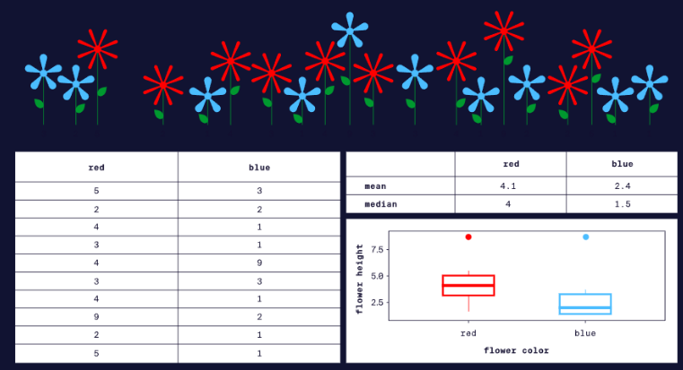
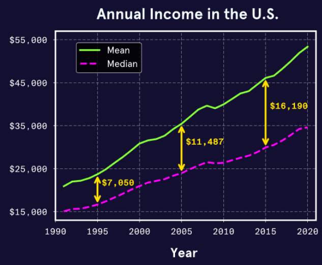
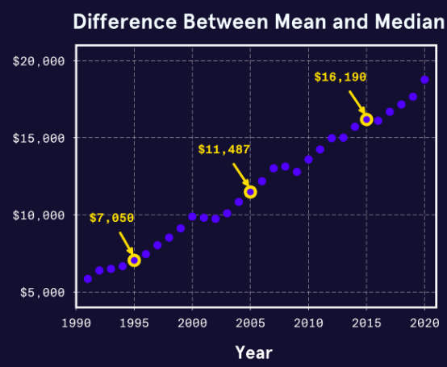
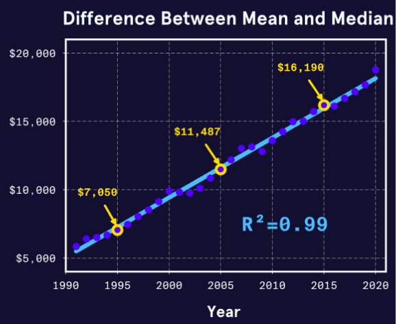
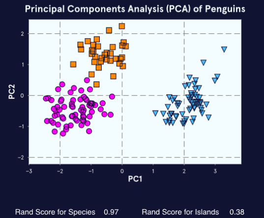
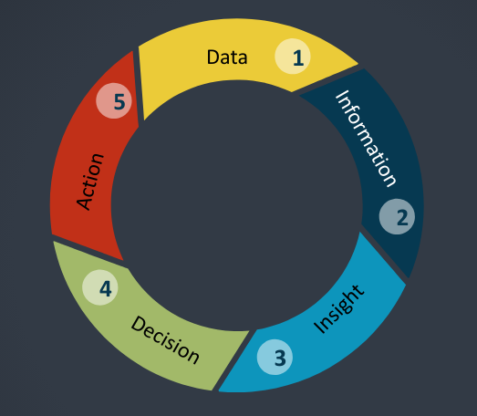

# 5. Analysis


## Data Analysis and Conclusions

Our primary goal of working with data is to draw conclusions that lead to insights. In business, those insights are hopefully to gain competitive advantage in order to **delight** our customers.

Data analysis is the process of noodling around in the data using math, our eyes (and occasionally banging our heads against hard objects) to discover useful information, which creates "informed" conclusions that support decision making.

We accomplish this by evaluating the presence, strength and direction of relationships between different variables in our data.

We'll discuss five types of data analysis: 
1. Descriptive Analysis
2. Exploratory Analysis
3. Inferential Analysis
4. Causal Analysis
5. Predictive Analysis

### Descriptive Analysis

This process describes summarizes and visualizes data to uncover patterns. 

Most of the time this is the first step of analysis. On rare occasions, it will be the only step. 

The "descriptives" are actually the summary statistics we went over in [Statistical Thinking](3-statistical-thinking.md). It is primarily our measures of central tendency (mean, median, mode) and measures of spread (range, quartiles, variance, standard deviation, distribution)

Generally speaking analysis is a 3 step process: collect, summarize, analyze and visualize. This might look like four but "analyze and visualize" is an iterative process that is connected. 

#### Purpose of Descriptive Analysis

- construct an understanding of our data
- determine what steps to take next

#### Limits of Descriptive Analysis

- learnings are too specific to be extended to other datasets


_Descriptive Analysis_


---

### Exploratory Analysis

This is the "second step of data analysis". Here, we look for relationships between variables and sometimes between entire datasets. 

Here we can answer questions of **what (correlation)**, but we still usually are unable to answer questions of **why (causation) **

#### General Process


The graph above is a multivariate comparison of the mean and median over time. (The mean and median are different variables using the same scale: money.)

There are annotations to show increasing difference between the two variables over time. 

As we compare the variables, there are typical questions we ask: 
- how is one variable changing? (mean)
- how is the other variable changing? (median)
- (we keep asking this for more variables...)
- how do the mean and median relate to each other? 


To gain new insights to additional questions, we might need to repeat some of the process (I told you it was iterative!) Is the increase in difference between the variables constant? let's create a new visual: 



Looks pretty linear to me, but if we want we can update the visualization (to annotate it w/ information that helps support key points)

**trend line**: A trend line is a line on a graph that shows the general trend of a group of data points. It's sometimes called **the line of best fit**. The goal is to minimize the distance between each data point and the line itself. 

In this case, we can CLEARLY see that the data is linear, but as you might recall from previous exercises, there were groups of data points that weren't as easy to distinguish (remember the 50% correlation coefficients?!?!)

**R-Squared**: (a.k.a. the **coefficient of determination**) is a statistical measure in regression models that determine the proportion of variance in the dependent variable that can be explained by the independent variable. 

In simpler terms, it shows how much of the change in one thing can be explained in another thing. It's a standardized scale, so values close to 1 means the data points fit the line very well, while a value close to 0 means they don't fit well at all. 



After adding the trend line and R-squared, it should be no surprise that this is linear, and the points in the line fit very closely. This means that the model explains almost all of the variability in the dependent of variable. (.99%)

That means that that 1% of the variability is explained by factors outside of the model. 

(Modeling and Linear regression come WAY later.)

#### Clustering

Clustering algorithms are a type of **unsupervised machine learning**. They are very userful (powerful) tools used in **(EDA) Exploratory Data Analysis**. 

It attempts to learn patterns from untagged data (data that aren't already attached to classifications). 

The value of clustering comes in the bang for its buck because it helps expose relationships between **many variables at once.**

It isn't easy to see relationships between measurements in raw data. Plotting them out individually is extremely time consuming, and its still fairly difficult to visualize holistically. 

##### PCA (Principal Component Analysis) 

This is a process that compresses variables into principal components that can be plotted against each other. Once this is performed, we can use **k-means clustering** to look for trends in the data. (k-means clustering is an algorithm that attempts to group data points into a set (k) number of clusters, based on their proximity to a centroid. Don't worry about this yet. It's just a way to organize data in groups.)



In the PCA above, we can see that our data shows 3 penguin species living on 3 different islands. 

The rand score is another standardized measure of best fit, specifically for measuring the strength of the relationship of a variable. 

---

### Inferential Analysis

This is the third step in the analytical process. At this point, we know our data very well, and it's likely that we have uncovered a litany of relationships. 

Inferential analysis is the process of testing a hypothesis against a sample of the population and then extending those conclusions to the entire population. (This is sometimes referred to as **lab-then-field** analysis.)


#### Defining some terms. 

These terms get discombobulated quite a bit in statistics and science, so I'm going to try to provide some ways to help you remember them. 

**Control Variables**: These are the things you keep the same, they don't change. This is usually confused w/ the independent variable. The way I think of it is "command and control" organizations get nothing done... so... nothing changes! :) It's cynical, but it helps. 

**Independent Variable:** This is what we can decide to change in an experiment. I memorized this statement to keep this term straight "**Independent** of everything else, this is the variable I can change."

These two variables are similar, but **independent variables** change while **control variables** do not. In most testing, the use of a control variable and a dependent variable are all that's necessary. Independent variables are a requirement for defining statistical null hypotheses which we'll cover in a future module.

**Dependent Variable:** This is the observed value or what you measure. According to our hypothesis, this variable should change (or not) based on changes in the independent variable. 


Now that we've defined these terms, the most common method of inferential analysis is A/B testing. (UX again!??!)

The basic process is: 
- we make a hypothesis based on our understanding of patterns in data
- we create an A/B sample where (usually) A has a control variable, and B has no change or a test variable.
- we use statistical tools to determine how likely it is the results occurred due to chance. (remember these processes?)


The use of statistical tools in this manner are to increase our confidence that we can extend the results to the whole population. I.e. we can infer (from evidence and reasoning rather than from explicit statements) that the resulting outcome of the A/B experiment is NOT due just to chance. 

Fun Fact, the word **apriori** means _relating to or denoting reasoning or knowledge which proceeds from theoretical deduction rather than from observation or experience_

#### Important Factors of Inferential Analysis

**Sample size** is an important concept. A sample must be large enough when compared to the total population size in order to be considered "safe" to be applied to that population. 10% is a good rule of thumb, and it is custom to perform multiple iterations to increase confidence. 

Randomization of the sample population is important, however there are schools of thought that randomness in samples that don't reflect a facsimile of a population's demographic landscape are poor representatives. (This is usually vetted out through standardization and coefficients of determination)

Lastly, **we can only test a single hypothesis at a time.** There is no "two birds with one stone" in data analysis. In science, this interference is a contaminant that invalidates results, wasting time and money. 

### Causal Analysis

Generally, causal analysis relies on carefully designed experiments. In certain cases, observational data is sufficient but not often. 

There are several experimental constraints required to support causal analysis: 
- **correlation does NOT equal causation**
- only change **one variable** at a time. 
- we must carefully controll **all** other variables
- Must be repeated multiple times w/ the same results.
- **correlation does NOT equal causation**


#### Good Experimental Design

**Replication**: Gather enough subjects (replicates) to support statistical analysis. 

**Randomization**: Assign subjects randomly into treatment groups, so each subject has an equal chance to be in any treatment group. 

**Control**: Control all factors that aren't the experiment's focus but could influence the outcome. (There are exceptions to this called **confounding variables**.)


- **correlation does NOT equal causation** :) It's important. 

Proving causation is very difficult. While quality data is a requisite for quality insights from analysis, we can't prove causality without carefully designed experiments. 


### Causal Analysis with Observational Data

Now that I've mentioned these careful requirements for determining causality, forget most of it! (Just kidding). 

Pragmatically, the necessary experiments to prove causality may be unethical, too expensive, too difficult or flat out impossible. We can't kill patients to test theories on how long the brain can survive without oxygen. 

The workaround is that we can apply **causal inference techniques** that are applied to observational data. Think of it as a second pass through the previous "inferential analysis" step using different constraints: 
- advanced statistical techniques are used to ID a causal effect. (we'll get to these a while down the road)
- meeting **very strict conditions**
- appropriate statistical tests. 

### Predictive Analysis

The next logical step beyond determining causality, is prediction. This uses data and **supervised machine learning** to identify the probability of certain future outcomes occurring. 

Examples of Predictive Analysis in the wild: 
- Netflix Recommendations
- Text Auto Complete
- Facial Recognition
- Self-driving cars

Examples of Supervised ML techniques: 
- regression models
- SVM (Support Vector Machines)
- Deep Learning CNNs (Convolutional Neural Networks)

The algorithm is quite different for each technique, and each of them require **training data**. Training data is a set of "already-classified" data that an algorithm can "learn" from. Once the algorithm has learned from the features of the training data, it can make predictions about new data. 


It is extremely critical to consider the following statements: 
- **The algorithm is only as good as the data used to train it**
- **Predictive models trained on poor-quality data will make poor-quality predictions**

Predictive Analysis is still immature. It's excellent for low-risk predictions. While mildly perturbed, only a very small number of people were harmed by recommendations of "Keeping Up With The Kardashians." In contrast, nuclear power plants, hospitals, etc. aren't ready to apply predictive systems. 

## Bias

**Bias** is systematic error in thinking influenced by cultural and personal experiences. It distorts are perception and leads us to make incorrect decisions. 

Anyone alive today knows that they are surrounded by bias. It is everywhere. In our news, in our homes, in our minds. 

Yes, it is in our data too. 

**Automation bias** stems from the idea that computers are more trustworthy than humans because they are more objective. This isn't true. They aren't completely objective, because they inherit the bias of their creators. (Us!) Data analysis can improve decision-making, but the computers aren't immune to bias. 

One of the more modern principles of **responsibility in tech** is the responsible use of data and algorithms. This type of responsibility requires an understanding of the different categories of bias that occur during each stage of analysis. 


### Bias in Data Collection

**Selection bias (or sample bias)** occurs when the study subjects (sample) aren't representative of the population. This is usually a side effect of poro study design. (The sample is typically too small or not sufficiently random).

This can also occur when limited data available is influenced by **historical bias**, which is a systematic influence based on historic social/cultural beliefs. 

One of the most famous examples of this type of bias is [Amazon's hiring algorithm](https://www.imd.org/research-knowledge/digital/articles/amazons-sexist-hiring-algorithm-could-still-be-better-than-a-human/#:~:text=In%20Amazon's%20case%2C%20its%20algorithm,was%20a%20factor%20in%20success.) that was biased against hiring women. 


#### Techniques to avoid Selection Bias
- Do as much as you can to obtain a **representative sample** (remember this!?), not just a convenient one.
- **Diversify** your data through the use of data inputs from multiple sources. 

```text
NOTE: Diversification of this type is a very powerful and multi-purpose
tool for de-risking. 
```


### Bias in Building and Optimizing Algorithms

**Algorithmic bias** occurs when an algorithm produces systematic and repeatable errors that lead to unfair outcomes (i.e. privileging one group over another). This type of bias is often initiated by **selection bias** and then reinforced, perpetuated and potentially magnified by other types of bias. 

It's important to remember that many algorithms are intentionally biased. Various categories of software problems (like sorting, searching, prioritized queueing) are predicated on characteristics of bias that we require to solve these
problems effectively. 

When using third-party tools, this can be a Black Box problem. In many cases we don't know what data is used to train and test the algorithm, and we don't know how it was designed or how it works. [Gender Shades](http://gendershades.org/index.html) is a famous example of algorithmic bias. It exposed systematic errors in facial recognition software that led to unintentional profiling based on ethnic or gender-specific characteristics. 


**Evaluation bias** is the result of testing an algorithm with a non-representative dataset. It results in overall high accuracy scores (false positives)  even if the algorithms being tested were inaccurate for groups or subpopulations. Evaluation bias was the underlying cause of the gender shades project's algorithmic bias. The initial dataset used to train the algorithm had very low portions of dark-skinned subjects and an especially low proportion of dark-skinned females. 

Intelligence is at the mercy of its input. 

#### Avoiding Algorithmic Bias
- Transparency, especially in the data that we use to train and test the algorithm. 

### Bias in Interpreting Results and Drawing Conclusions

**Confirmation bias** is our tendency to seek out information that supports our views. This skews data analysis when we consciously or unconsciously interpret data in a way that supports our original hypothesis. 

This type of bias is especially prevalent and hardened in academics and experts. It's also a brief "phase" for people who are learning something new. (We learn something new, and strive to apply it, seeing that pattern everywhere!)

Confirmation bias can be avoided by: 
- good up front study/experiment design
  - clearly state the hypothesis and goals of the experiment in advance. This ensures that we can't manipulate purpose based on our findings. 
- require **honest evaluations**: DIVERSIFY! (See, it's a swiss army knife!)
  - ensure that there is always a second pair of eyes to qualify or challenge results. 
  - invite people from different teams to review findings to avoid "herd mentality" or "groupthink" common from getting second opinions from immediate coworkers. 


**Overgeneralization bias** is an inappropriate extension made about one dataset to other datasets. This can lead to overinterpretation of results and unjustified extrapolation of insights and conclusions. 

We can avoid this by:
- being thoughtful about applying our data
- avoid extending results beyond the dataset used to generate those results unless it is justified and can be supported with evidentiary data. 
- avoid extending results beyond the proper population. 

_Side Note: (Re:Data Mesh) One of the advantages of applying Domain-Centricity and Product Thinking to Data-as-a-Product is the notion of self-containment. This notion has built-in resiliency to this type of bias within the boundaries of a single DaaP. This ensures that aggregations occur in a thoughtful manner._ 

**Reporting bias**, similar to confirmation bias, is the human tendency to only report or share results that affirm our beliefs or hypothesis. (This is the same type of bias that influences some people to only report the good news.) This is extremely common in the media, where editors, publishers, speakers, readers become more and more biased as positive results are published, read and cited more often. (There are often causal links between reporting bias and groupthink.)

The best way to avoid this type of bias is to face the music! Report negative results, and cite others who do too. Stay balanced in your approach. 


---

I usually ended this module with bias, because its quite thought-provoking. Despite good data, well-structured experiments and strict (but reasonable) adherence to good process, our biases can wreck everything. 


There is a concept that comes under many names "Path to Insight", "Analytical Path To Value", "Circle of Intelligence", and so on. It is a neverending process. It happens in our brains, it happens with the data we curate daily and it happens all around us. It consists of several steps (which can vary from 3-5)



1. **Data** is about collecting relevant, complete and reliable data. It doesn't have much context yet. 
2. **Information** is data that has been given context through various forms of wrangling: cleaning, converting, combining, organizing, massaging, transforming, and so on. Information is the foundation of **reporting**. 
3. **Insights** are gleaned from information. An insight is a deep(er) understanding of the data, above and beyond reporting. It comes from exploring data and the reports to convert it into something new. Insights are created by **analysis or analytics**
4. **Decisions** (we know what decisions are!) in this context are about what to do with the insights we've learned. This phase of the path is where AI lives today. For simple tasks, we can completely automate decisions in the most primitive forms of intelligence. However, in many (most) cases, humans have to figure out what to do with the insights generated by step 3. 
5. **Action** (sometimes combined with decisions) is actually carrying out (or not carrying out) the decision to act. The reason we (or at least I) separate this out is because for the most complex decisions, action isn't the snap of a finger. It is weeks or months of planning, iteration, execution and iterative composite cycles of the previous 4 stages. 

After stage 5, we get new data and start all over again. This cycle continues to become more and more automated over time, but still involves people, and as long as people are part of the collection and interpretation of data, bias is a risk to the quality and veracity of that data. The only way to eliminate bias in our data, is a cultural shift towards acknowledgement of personal bias, acceptance that we're unlikely to ever rid ourselves of them completely, and adoption to a culture of curiosity and humility to support each other.

_Fini_


